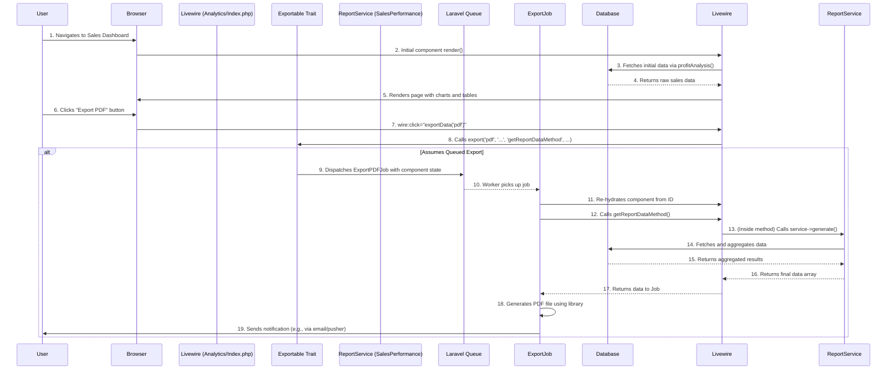

# Reporting System Audit: 01 - Current Architecture

## 1. Introduction

This document provides a detailed deconstruction of the current architecture of the SweetTooth application's reporting system. Understanding the existing structure, its components, and their interactions is a prerequisite for identifying weaknesses and formulating meaningful improvements. The architecture is analyzed from a layered perspective, followed by an end-to-end data flow walkthrough.

## 2. High-Level System Components

The reporting system is primarily built upon the TALL stack (Tailwind, Alpine.js, Laravel, Livewire), leveraging several key Laravel features and a few specialized packages. The core components involved are:

| Component Type          | Key Examples                                                                       | Role in the System                                                                                               |
| ----------------------- | ---------------------------------------------------------------------------------- | ---------------------------------------------------------------------------------------------------------------- |
| **Livewire Components** | `app/Livewire/BranchDashboard/SalesDashboard/Analytics/Index.php`                  | The primary user interface for displaying report data and initiating report generation requests. Acts as a controller. |
| **Service Classes**     | `app/Services/Reports/ReportService.php` (Abstract), `SalesPerformanceReportService.php` | Encapsulates the business logic for fetching, processing, and preparing report data.                             |
| **Eloquent Models**     | `App\Models\Sale`, `App\Models\Item`, `App\Models\DepartmentReport`                | Represents the core business entities and provides the data access layer via Eloquent ORM.                       |
| **Queued Jobs**         | `app/Jobs/ExportExcelJob.php`, `app/Jobs/ExportPDFJob.php`                         | Handles the asynchronous generation of report files to avoid blocking UI processes.                              |
| **Traits**              | `app/Traits/Exportable.php`                                                        | A reusable piece of logic injected into Livewire components to handle the boilerplate of triggering exports.     |
| **Route Files**         | `routes/web.php`, `routes/accounting.php`                                          | Defines the URL endpoints that map to the reporting-related Livewire components and controllers.                 |
| **Configuration**       | `config/queue.php`, `config/database.php`                                          | Governs the behavior of background jobs and database connections, which are critical for reporting.              |
| **Database Tables**     | `sales`, `sale_items`, `items`, `department_reports`                               | The persistent storage for the raw data and, in some cases, the generated report results.                        |

## 3. Architectural Layers

The system can be conceptually divided into three main layers:

### 3.1. Presentation Layer
-   **Technology:** Livewire, Blade, Tailwind CSS, Alpine.js, Highcharts.
-   **Description:** This layer is what the user interacts with. Livewire components like `Analytics/Index.php` and their corresponding Blade views (`analytics/index.blade.php`) are responsible for rendering the UI, displaying charts and data tables, and capturing user input (e.g., date range selections, button clicks). This layer acts as the "controller" in a traditional MVC sense, orchestrating backend calls in response to user actions.

### 3.2. Application/Service Layer
-   **Technology:** Laravel Services, Queued Jobs, Traits.
-   **Description:** This layer contains the core business logic.
    -   `ReportService` and its implementations are responsible for the "heavy lifting" of data aggregation.
    -   The `Exportable` trait acts as a bridge between the Presentation Layer and the Job Layer, deciding whether to execute a report generation immediately or dispatch it to the queue.
    -   The Jobs themselves (`ExportExcelJob`, etc.) encapsulate the final step of report creation, running independently in the background. This separation is crucial for asynchronous processing.

### 3.3. Data Access Layer
-   **Technology:** Eloquent ORM.
-   **Description:** This layer is responsible for all database interactions. Eloquent models (`Sale`, `Item`, etc.) are used to query for the raw data needed by the Service Layer. The `department_reports` table also serves as a persistence mechanism for report results generated by `ReportService`.

## 4. End-to-End Data Flow Analysis: Sales Dashboard Analytics

To illustrate how these layers interact, let's trace a typical user journey: generating a sales analysis report.

**Scenario:** A branch manager navigates to the Sales Dashboard and requests a report for the last 30 days.

**Flow Description:**

1.  **Initial View:** The user's browser renders the Livewire component. The component's `render()` or `mount()` method calls `profitAnalysis()`, which performs a direct, and currently inefficient, query against the database to fetch data for the initial on-screen charts.
2.  **User Action:** The user clicks an export button, triggering a `wire:click` event.
3.  **Orchestration:** The `exportData()` method inside the `Analytics/Index.php` component is called.
4.  **Trait Invocation:** This method immediately invokes the `export()` method from the `Exportable` trait.
5.  **Queueing:** The `Exportable` trait determines that this should be a queued export. It creates a new `ExportPDFJob` (or another format) and `dispatch()`-es it to the Laravel queue. **Crucially, it passes component state, NOT the full data collection.**
6.  **Background Processing:** A queue worker picks up the job. The job re-hydrates the Livewire component and calls the specified data-gathering method (e.g., `getProfitAnalysisReportData`).
7.  **Service Logic:** This data-gathering method, in turn, may instantiate and call a dedicated `ReportService` implementation.
8.  **Data Aggregation:** The `ReportService` executes the primary database query, performing the necessary aggregations and calculations to build the final report dataset.
9.  **File Generation:** The dataset is returned to the job, which then uses a library like `barryvdh/laravel-dompdf` to generate the physical file and save it to storage.
10. **Notification:** Upon successful completion, the job is responsible for notifying the user that their report is ready.

## 5. Database Schema for Reporting

The following tables are central to the reporting process:

-   `sales`: Contains the primary record for each transaction, including `sale_date` and `total_amount`. This is the main fact table for sales reporting.
-   `sale_items`: A junction table detailing the items included in each sale, with `quantity` and `price`.
-   `items`: The dimension table for products, containing `name` and, importantly, `cost_price` for profitability analysis.
-   `department_reports`: This table appears to be a form of cache or storage for pre-generated reports. The `ReportService` saves its results here with a `report_name`, `data` (JSON), and timestamps. This could be used for historical reports or for dashboards that don't need real-time data, but its integration with the dashboard components is not immediately clear.
-   `jobs` / `failed_jobs`: The standard Laravel tables for managing the queue, which is an integral part of the asynchronous reporting architecture.
